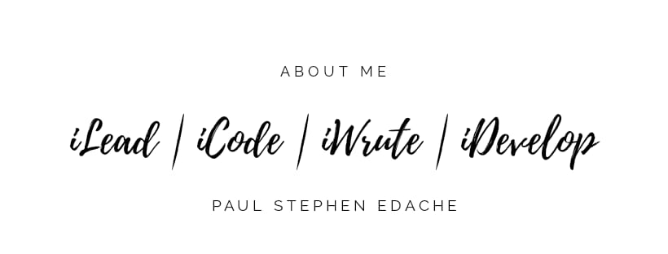

# [Paul Stephen Edache](https://CounsellorDev.GitHub.io/)
NodeJs | Flutter | Python

  <b><i>Let's connect! Find me on the web.</i></b>

[][twitter]
[][medium]
[][linkedin]
[][facebook]

[][hashnode]
[][youtube]
 

<h2> 𝐇𝐞𝐥𝐥𝐨 𝐭𝐡𝐞𝐫𝐞, 𝐟𝐞𝐥𝐥𝐨𝐰 <Devs/>! </h2>
 
* Primary coding language: JavaScript.
* I’m currently working on my portfolio.
* I am currently learning Flutter
* I have contributed to Open source projects.
* Competitive Programmer 
* Ask me about anything, I'll be happy to help.
* 😄 Pronouns: He/Him

<table><tr><td valign="top" width="50%">

### My Digital Garden 🌱
You can find my blogs at my [Website](https://CounsellorDev.GitHub.io).

</td>

<td valign="top" width="45%">

### The Developer Dictionary 🌱
Check out my latest videos on [YouTube](https://www.youtube.com/cousellorDev).

</td>

<h3 align="center">Show some &nbsp;❤️&nbsp; by starring some of the repositories!</h3>

[twitter]: https://twitter.com/CounsellorDev
[youtube]: https://youtube.com/CounsellorDev
[hashnode]: https://CounsellorDev.com
[gmail]: https://gmail.com
[linkedin]: https://www.linkedin.com/in/CounsellorDev/
[medium]: https://medium.com/@Stepaul
[facebook]: https://www.facebook.com/CounsellorStephen